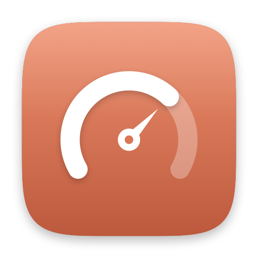
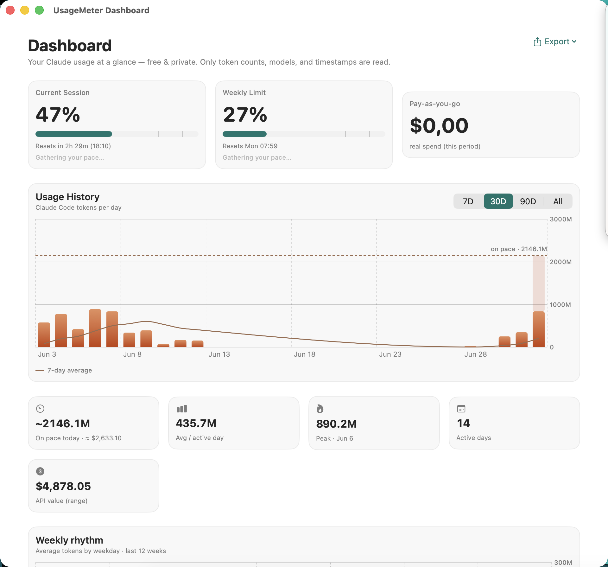
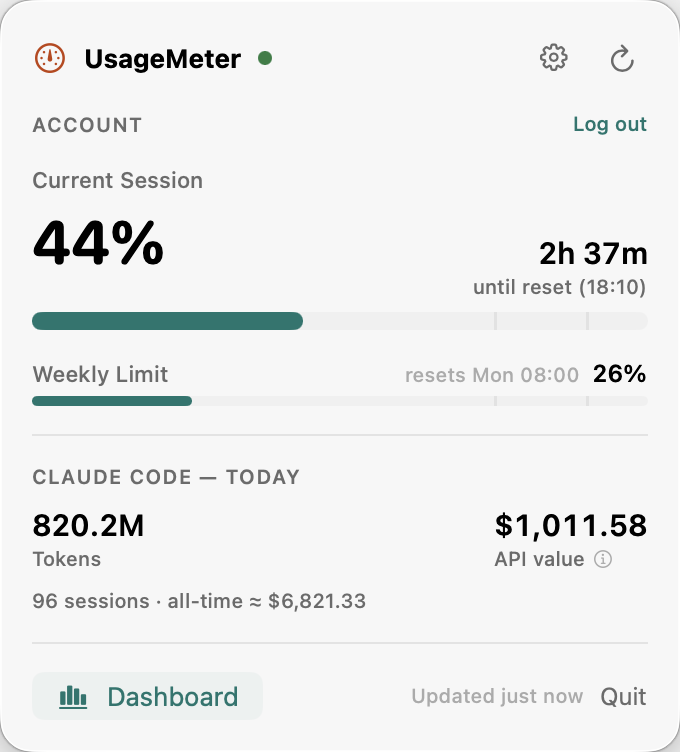

<p align="center">
  
</p>

<h1 align="center">UsageMeter</h1>

A small, fast, **native macOS menu-bar app** that means you never hit Claude
limits unexpectedly — free and private, no subscription, no telemetry.

It tracks three independent things:

- **Account (claude.ai)** — your real **session %**, **weekly %**, **weekly Opus %**,
  reset times, and **real pay-as-you-go spend**, straight from your own claude.ai
  account (after you log in).
- **Claude Code** — tokens, "API value", and per-model / per-project breakdowns read
  from local Claude Code logs. **No login, no network.**
- **Service status** — a live "Claude is up / degraded / down" badge from Anthropic's
  public status page.

> **Privacy is a hard rule.** UsageMeter reads only **token counts, model names, and
> timestamps** from your local logs — **never your messages**. For your account it
> reads only **usage percentages, reset times, and your own spend** — never
> conversation content. Everything stays on your Mac; nothing is sent anywhere.

---

## Screenshots

<p align="center">
  
</p>

<p align="center">
  
</p>

---

## Download

**[⬇️ Download the latest release](https://github.com/OmerYasirOnal/UsageMeter/releases/latest)** —
grab `UsageMeter-macOS.zip`, unzip, and drag **UsageMeter.app** into your Applications folder.
Look for the gauge icon in the menu bar.

> **First launch:** the app is signed ad-hoc (not yet notarized), so macOS Gatekeeper
> will warn on the first open. **Right-click the app → Open** once, or run
> `xattr -dr com.apple.quarantine /Applications/UsageMeter.app`. A notarized build and
> an App Store release are planned.

Requires **macOS 15 (Sequoia) or later**. Prefer to build it yourself? See
[Build, run & install](#build-run--install).

---

## Features

- 🎛 **Menu-bar popover** — live session / weekly / Opus % with progress bars, reset
  countdowns, real spend, today's Claude Code tokens + API value, and a status dot.
  Optionally shows the session % right in the menu bar.
- 📊 **Dashboard** — usage-history chart (7D / 30D / 90D / All), Insights cards, a
  12-month GitHub-style activity heatmap, by-model / by-project breakdowns, and a
  Claude Code summary. Export to **CSV** or a shareable **PNG**.
- 🔔 **Smart notifications** — at 50 % / 75 % / 90 %, plus a smoothed burn-rate alert
  ("on track to hit your limit before it resets").
- 🌗 **Appearance** — System / Light / Dark, plus launch-at-login.
- 🔒 **Local-first & private** — three decoupled sources; the app stays fully useful
  even when you never log in (Claude Code + status still work).

## Requirements

- macOS 15 (Sequoia) or later (developed on macOS 26).
- Swift 6 toolchain (Xcode 26 or the matching command-line tools).

No third-party dependencies.

## Build, run & install

```bash
make test      # 144 headless tests — no network or real data needed
make run       # build UsageMeter.app and launch it
make app       # just build ./UsageMeter.app
make install   # build and copy to /Applications
make xcodeproj # generate the Xcode app target for App Store archiving (needs XcodeGen)
```

You can also open the package in Xcode: **File ▸ Open… ▸ `Package.swift`**.

When running, look for the **gauge icon** in the menu bar; click it for the popover.

> **Why SwiftPM instead of an `.xcodeproj`?** Zero external tooling, the engine is
> testable headlessly with `swift test`, and the build is reproducible from the
> command line. `Scripts/make_app.sh` assembles a proper `.app` bundle (with
> `Info.plist` / `LSUIElement`) so launch-at-login and menu-bar behavior work like a
> normal app.

## How the account source works (and a Terms-of-Service note)

There is **no official public API** for the claude.ai consumer subscription
session / weekly %. The Usage page itself uses claude.ai's internal endpoint, so
any app showing these numbers reads that same endpoint with your own logged-in
session. UsageMeter does this transparently:

- **Login** in a `WKWebView` (we never see your password). Your session is stored in
  an isolated, app-private data store; **Log out** wipes it.
- **Empirical discovery** — a hook in the login window observes only **usage-shaped,
  first-party** API responses to learn the endpoint; it never touches conversation
  or account traffic.
- **Headless refresh** — the discovered endpoint is replayed with your cookies
  (scoped to that host) and decoded; it's isolated behind the `AccountUsageClient`
  protocol so breakage is contained and the app degrades to local-only mode.

⚠️ Automating authenticated access to claude.ai is a **Terms-of-Service grey area** —
review Anthropic's current Usage Policy / Terms before relying on it. Logging in is
entirely optional; the app is useful without it.

## Privacy

- **Source B (local logs):** only `type`, `isSidechain`, `requestId`/`uuid`,
  `timestamp`, `message.model`, and `message.usage.*` are read. Never message content.
- **Source A (account):** only usage percentages, reset times, and your own spend.
- Local caches live in `~/Library/Application Support/UsageMeter/` and never leave
  your machine. "Log out" wipes the account session and discovery files.

Full policy: [`PRIVACY.md`](PRIVACY.md) · [omeryasironal.github.io/UsageMeter/privacy.html](https://omeryasironal.github.io/UsageMeter/privacy.html)

## "API value" vs real spend

On a flat subscription, the dollar figure for Claude Code tokens isn't money you
spent — it's what those tokens **would** cost on the pay-as-you-go API ("API value"
= the value you get from your subscription). You can hide it in Settings. Your
**actual** spend is read from claude.ai and shown separately as "Pay-as-you-go used".

## Architecture

Three decoupled sources behind protocols, orchestrated by a `DataEngine` actor. See
[`CLAUDE.md`](CLAUDE.md) for the full architecture, the privacy rule, and the
Source-A caveat. The engine (`UsageMeterKit`) is 100 % headless-testable.

## Contributing

Contributions welcome — see [`CONTRIBUTING.md`](CONTRIBUTING.md). Please keep the
**privacy hard rule** intact: never read or persist message content.

## License

[MIT](LICENSE) © Omer Yasir Onal.

*Not affiliated with or endorsed by Anthropic. "Claude" is a trademark of Anthropic.*
